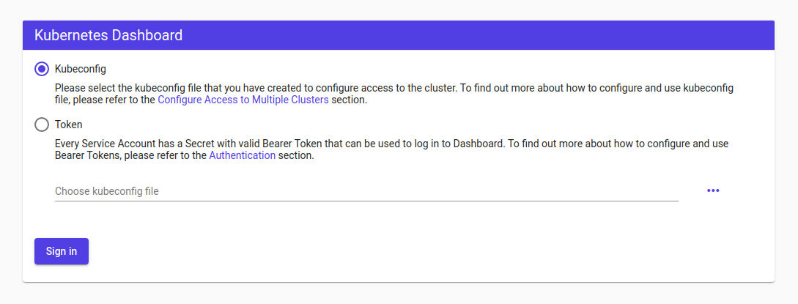
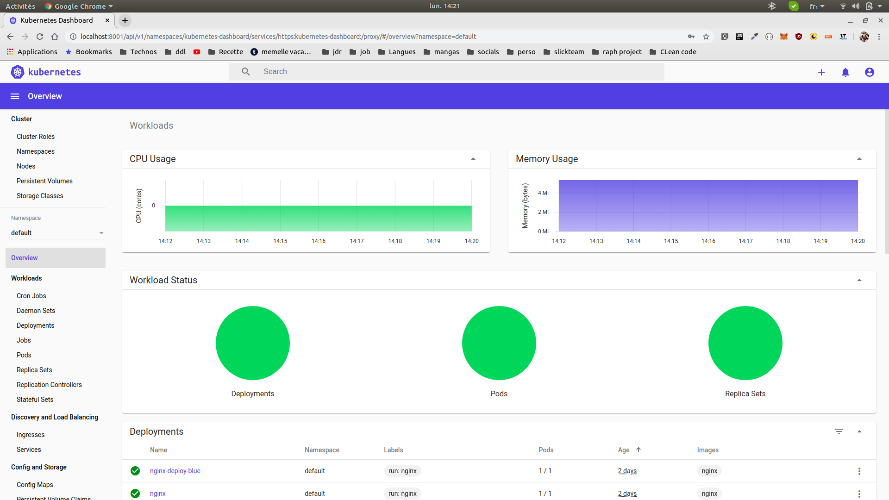

# Adding the kubernetes UI

## Objective

Adding the kubernetes UI to the cluster. The complete documentation can be found [here](https://kubernetes.io/docs/tasks/access-application-cluster/web-ui-dashboard/)

## Installation

Install the kubernetes UI
```shell script
kubectl apply -f https://raw.githubusercontent.com/kubernetes/dashboard/master/aio/deploy/recommended.yaml
```
the kubernetes UI is secured with Role Bases Access Control (rbac). Add add the authorization. To follow [the official documentation](https://github.com/kubernetes/dashboard/blob/master/docs/user/access-control/creating-sample-user.md), You will create an `admin-user` which will be authorize to access to the dashboard.

__IMPORTANT__: Make sure that you know what you are doing before proceeding. Granting admin privileges to Dashboard's Service Account might be a security risk. 

From the root of the repository:
```shell script
kubectl create -f dashboard/dashboard-adminuser.yaml 
```
Now let's find the generated token from the secret.
```shell script
kubectl -n kubernetes-dashboard describe secret $(kubectl -n kubernetes-dashboard get secret | grep admin-user | awk '{print $1}')
```
The documentation warn you that we should be really careful to expose the dashboard. Exposing the dashboard can exposed to security issues for all the cluster. The recommanded safe methode to access the dashboard is to use the [kubectl proxy](https://kubernetes.io/docs/tasks/access-kubernetes-api/http-proxy-access-api/).
```shell script
kubectl proxy
```
Now you can access to the dashboard with this url: http://localhost:8001/api/v1/namespaces/kubernetes-dashboard/services/https:kubernetes-dashboard:/proxy/. You shoud see this screen : 


* Choose the token options and past the previous token. You should have access to the dashboard.

## Adding metrics
You have access to the dashboard. But it misses the metrics. To add the metrics, we need to add the `metrics-server`. You can find the documentation [here](https://kubernetes.io/docs/tasks/debug-application-cluster/resource-metrics-pipeline/)
and [here](https://github.com/kubernetes-sigs/metrics-server)

Fisrt, let's test if the `metrics-server` is already installed or not.

```shell script
kubectl top node
```
If the reponse is something like:
```shell script
NAME                CPU(cores)   CPU%   MEMORY(bytes)   MEMORY%   
kmaster.example.com   145m         14%    1198Mi           66%       
kworker1.example.com   26m          2%     966Mi           54%       
kworker2.example.com   30m          3%     975Mi           54% 
```
This means that the `metrics-server` is already installed. If not, you will need to install it.

1. Clone the `metrics-server` git repository.
```shell script
https://github.com/kubernetes-sigs/metrics-server.git
```
Unfortunately you will have to edit the file `deploy/kubernetes/metrics-server-deployment.yaml`. Add this in the `args` of the container:
```yaml
          - /metrics-server
          - --kubelet-insecure-tls
          - --kubelet-preferred-address-types=InternalIP

```
now your file should looks something like:
```yaml
      containers:
      - name: metrics-server
        image: k8s.gcr.io/metrics-server-amd64:v0.3.6
        args:
          - --cert-dir=/tmp
          - --secure-port=4443
          - /metrics-server
          - --kubelet-insecure-tls
          - --kubelet-preferred-address-types=InternalIP
        ports:
        - name: main-port
          containerPort: 4443
          protocol: TCP
```
Then, let's install the `metrics-server`.
From the root directory of the `metrics-server` repository.
```shell script
 kubectl create  -f deploy/kubernetes/
```
You will have probably have to wait around 1 minute before having metrics.
Try this command:
```mysql based
kubectl top node
```
Or:
```shell script
kubectl top pod
```
If it display metrics. It means that the `metrics-server` is correctly installed.
Now you can go back to the Dashboard UI. Metrics should be displayed.

